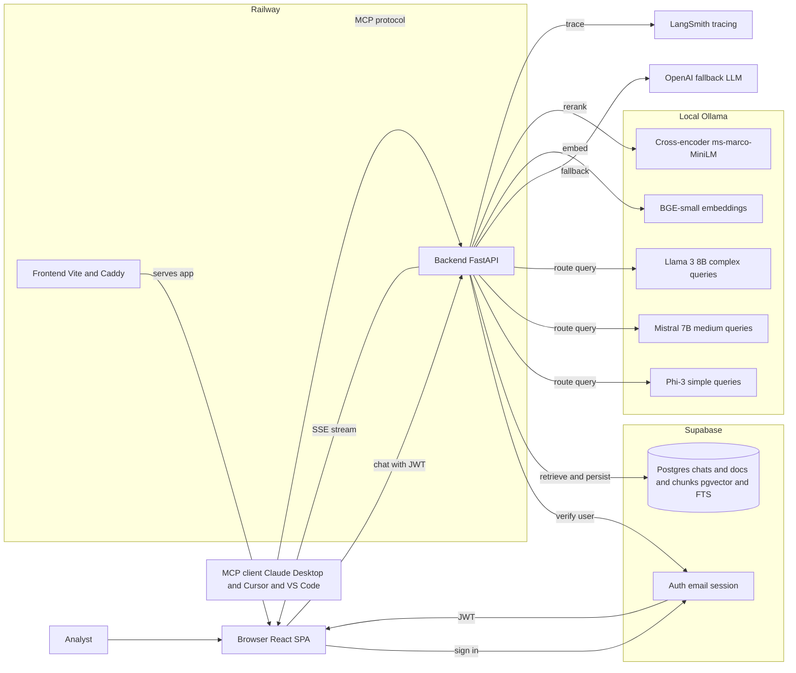
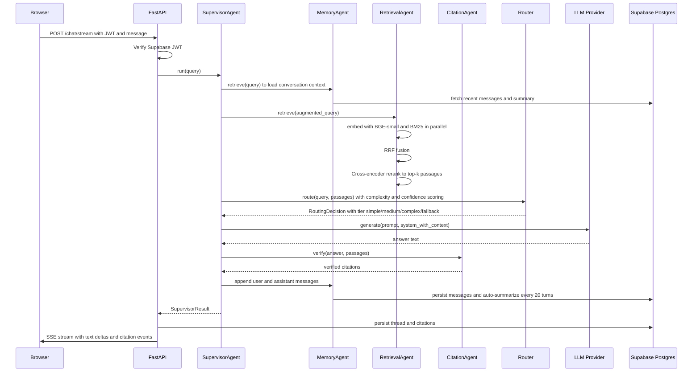
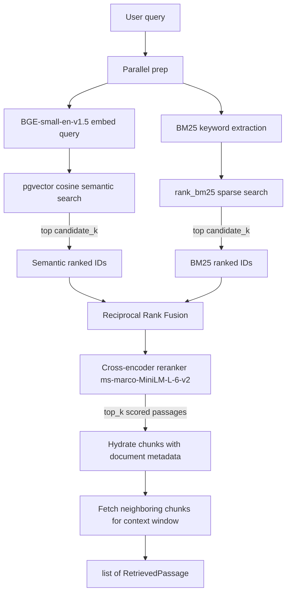
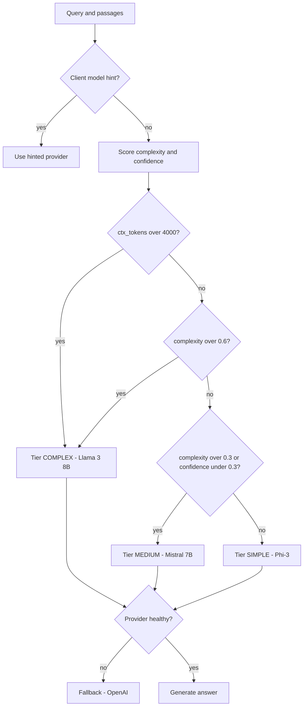
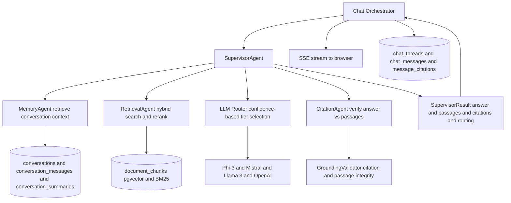
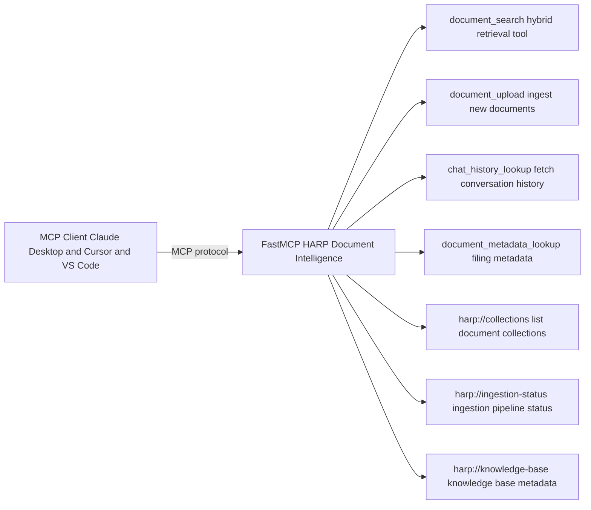
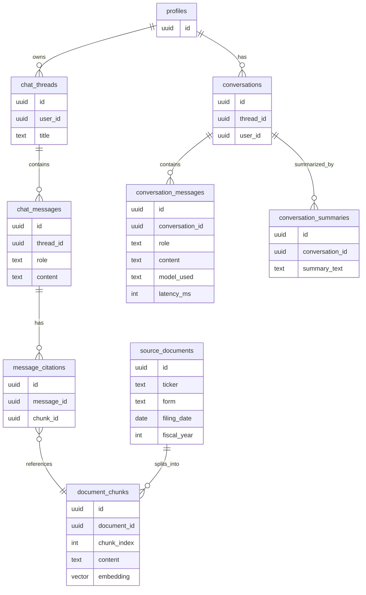

# HARP — AI Document Intelligence Platform

HARP is a production-grade RAG application that lets analysts query SEC filings (10-Ks, 10-Qs) in plain English and receive grounded, citable answers. It is built on top of a Document Copilot core and extends it with a multi-agent architecture, local LLM support via Ollama, confidence-based model routing, conversation memory, a native MCP server, and LangSmith observability.

---

## What's New vs. Document Copilot

| Capability |  |
|---|---|
| Embeddings | `BGE-small-en-v1.5` (local, free) |
| Sparse retrieval | BM25 (`rank_bm25`) |
| Reranking | Cross-encoder (`ms-marco-MiniLM-L-6-v2`) |
| LLM providers | Phi-3, Mistral 7B, Llama 3 8B + OpenAI fallback |
| Model routing | Confidence-based 3-tier router |
| Conversation memory | PostgreSQL-backed with auto-summarization |
| MCP server | Native (Claude Desktop, Cursor, VS Code) |
| Agent architecture | Supervisor + Retrieval + Citation + Memory agents |
| Observability | LangSmith tracing + structured metrics |

---

## Stack

| Layer | Choice |
|---|---|
| Frontend | Vite + React SPA + TypeScript, Tailwind CSS, shadcn/ui |
| Backend | Python 3.12+, FastAPI, PydanticAI |
| Database | Supabase Postgres (pgvector + FTS) |
| Migrations | SQLAlchemy models + Alembic |
| Auth | Supabase Auth (email) |
| Embeddings | `BGE-small-en-v1.5` (local via `sentence-transformers`) |
| Sparse retrieval | BM25 (`rank_bm25`) |
| Reranker | `cross-encoder/ms-marco-MiniLM-L-6-v2` |
| LLM providers | Phi-3, Mistral 7B, Llama 3 8B (Ollama) + OpenAI fallback |
| MCP | `fastmcp` — 4 tools, 3 resources |
| Observability | LangSmith + `structlog` |
| Hosting | Railway (frontend + backend), Supabase (database) |

---

## Architecture

### High-Level Service Map



---

### Request Flow (Chat Turn)



---

### Retrieval Pipeline



---

### LLM Routing



---

### Multi-Agent Architecture



---

### MCP Server



---

### Data Model



---

## Repo Layout

```text
harp/
├── backend/
│   ├── app/
│   │   ├── agents/          # supervisor, retrieval, citation, memory agents
│   │   ├── api/             # FastAPI routes (chat, auth, memory)
│   │   ├── assistant/       # PydanticAI agent, deps, outputs, instructions
│   │   ├── auth/            # Supabase JWT verification
│   │   ├── chat/            # orchestrator, streaming, message helpers
│   │   ├── database/        # SQLAlchemy models, session, Supabase client
│   │   ├── grounding/       # citation validator
│   │   ├── llms/            # phi3, mistral, llama3, openai providers + router
│   │   ├── mcp/             # FastMCP server, 4 tools, 3 resources
│   │   ├── observability/   # LangSmith tracing + metrics
│   │   └── retrieval/       # dense (BGE), sparse (BM25), reranker, RRF, types
│   ├── alembic/             # DB migrations
│   ├── ingest/              # SEC filing download, chunking, embedding pipeline
│   ├── scripts/             # smoke tests, re-embed utility, Ollama setup
│   └── tests/               # unit + integration tests
├── frontend/
│   ├── src/
│   │   ├── components/      # chat UI, citations, source passages, model selector
│   │   ├── hooks/           # useChatTransport, useSession, useThreads
│   │   ├── lib/             # api, http, citations, env, supabase client
│   │   └── pages/           # Login, SignUp, ChatThreadPage, ChatEmptyPage
│   └── Caddyfile            # production static file serving
├── data/                    # SEC EDGAR download + markdown conversion scripts
├── docs/                    # architecture, guides, claude_desktop_config.json
└── docker-compose.yml
```

---

## Prerequisites

| Tool | Version | Purpose |
|---|---|---|
| Python | 3.12+ | Backend runtime |
| [uv](https://docs.astral.sh/uv/) | latest | Python dependency management |
| Node.js | 20+ LTS | Frontend toolchain |
| pnpm | latest | Frontend package manager |
| [Ollama](https://ollama.com/) | latest | Local LLM inference |
| Docker | latest | Compose-based local stack |

External services: Supabase project (auth + Postgres) and an OpenAI API key (fallback LLM).

---

## Quick Start

### 1. Clone and pull Ollama models (~15 GB)

```bash
git clone <repo>
cd harp
bash backend/scripts/setup_ollama.sh
```

This pulls `phi3`, `mistral`, and `llama3` into Ollama.

### 2. Configure environment

```bash
# Backend
cd backend
cp .env.example .env
```

Fill in `backend/.env`:

```
SUPABASE_URL=
SUPABASE_ANON_KEY=
SUPABASE_SERVICE_ROLE_KEY=
DATABASE_URL=          # direct connection string, not the pooler
OPENAI_API_KEY=        # used as fallback LLM
LANGCHAIN_API_KEY=     # optional, enables LangSmith tracing
ALLOWED_ORIGINS=http://localhost:5173
```

```bash
# Frontend
cd ../frontend
cp .env.example .env
```

Fill in `frontend/.env`:

```
VITE_API_BASE_URL=http://localhost:8000
VITE_SUPABASE_URL=
VITE_SUPABASE_ANON_KEY=
```

### 3. Install dependencies and migrate

```bash
cd backend
uv sync
uv run alembic upgrade head

cd ../frontend
pnpm install
```

### 4. Re-embed existing chunks (embedding dimension changed 1536 → 384)

```bash
cd backend
uv run python scripts/reembed_chunks.py
```

### 5. Start with Docker Compose

```bash
# From repo root
docker compose up
```

Or run services individually:

```bash
# Backend
cd backend
uv run uvicorn app.main:app --reload

# Frontend (separate terminal)
cd frontend
pnpm dev
```

Open `http://localhost:5173`.

---

## Ingest SEC Filings

```bash
# Download latest 5 10-K filings for AAPL, MSFT, NVDA, AMZN, GOOGL
uv run data/download.py

# Convert HTML → Markdown
uv run data/convert_to_markdown.py

# Load filing metadata into Supabase
cd backend
uv sync --extra ingest
uv run python -m ingest.load_source_documents

# Chunk and embed (BGE-small, dim=384)
uv run python -m ingest.chunk_and_embed --all

# Force-refresh one filing
uv run python -m ingest.chunk_and_embed --accession 0000000000-00-000000 --force
```

---

## MCP Server (Claude Desktop / Cursor / VS Code)

Copy the provided config to your MCP client:

```bash
# macOS
cp docs/claude_desktop_config.json \
   ~/Library/Application\ Support/Claude/claude_desktop_config.json
```

The MCP server exposes four tools (`document_search`, `document_upload`, `chat_history_lookup`, `document_metadata_lookup`) and three resources (`harp://collections`, `harp://ingestion-status`, `harp://knowledge-base`).

---

## LLM Routing

Queries are routed to one of three local models based on complexity score and retrieval confidence, with automatic OpenAI fallback if the target provider is unhealthy:

| Tier | Provider | When |
|---|---|---|
| SIMPLE | Phi-3 | complexity < 0.3 and confidence ≥ 0.3 |
| MEDIUM | Mistral 7B | complexity 0.3–0.6 or low confidence |
| COMPLEX | Llama 3 8B | complexity ≥ 0.6 or context > 4 000 tokens |
| FALLBACK | OpenAI | provider health check fails |

Clients can override routing by passing a `model_hint` in the request.

---

## Conversation Memory

The `MemoryAgent` persists every user and assistant turn to `conversation_messages`. Every 20 messages it automatically summarizes the conversation using OpenAI and stores the result in `conversation_summaries`. On the next turn the summary plus recent messages are prepended to the retrieval query, giving the agent persistent context across sessions.

---

## Observability

Set `LANGCHAIN_API_KEY` to enable LangSmith tracing. Every `SupervisorAgent` run is wrapped in a `trace_run` context that records name, metadata, and latency. Structured logs via `structlog` are emitted at every major pipeline step (routing decision, retrieval count, memory retrieve/append, citation verification).

---

## Testing

```bash
cd backend

# Unit tests (no external services)
uv run pytest -m "not integration"

# All tests including integration
uv run pytest

# Lint
uv run ruff check .

# Smoke test retrieval pipeline
uv run python scripts/smoke_retrieval.py

# Smoke test full assistant run
uv run python scripts/smoke_assistant.py
```

```bash
cd frontend
pnpm lint
pnpm build
```

---

## Deployment (Railway)

Railway runs two services pointed at the same Supabase project:

- **Frontend** — Vite build served by Caddy (`frontend/Caddyfile`).
- **Backend** — FastAPI + Uvicorn, stateless; all durable state lives in Supabase.

See `docs/guides/railway-deployment.md` for step-by-step setup.

> **Note:** Ollama models run locally or on a separate GPU instance. If you deploy to Railway without a GPU, set `OPENAI_API_KEY` and the router will always fall back to OpenAI.

---

## Environment Variables Reference

### Backend

| Variable | Required | Description |
|---|---|---|
| `SUPABASE_URL` | ✅ | Supabase project URL |
| `SUPABASE_ANON_KEY` | ✅ | Public anon key |
| `SUPABASE_SERVICE_ROLE_KEY` | ✅ | Server-side privileged key |
| `DATABASE_URL` | ✅ | Direct Postgres connection (not pooler) |
| `OPENAI_API_KEY` | ✅ | Fallback LLM + summarization |
| `LANGCHAIN_API_KEY` | ⬜ | Enables LangSmith tracing |
| `ALLOWED_ORIGINS` | ✅ | CORS origin list |
| `RETRIEVAL_TOP_K` | ⬜ | Final fused passages returned (default: 10) |
| `RETRIEVAL_CANDIDATE_K` | ⬜ | Candidates per search path (default: 50) |

### Frontend

| Variable | Required | Description |
|---|---|---|
| `VITE_API_BASE_URL` | ✅ | FastAPI base URL |
| `VITE_SUPABASE_URL` | ✅ | Supabase project URL |
| `VITE_SUPABASE_ANON_KEY` | ✅ | Public anon key |
